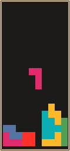

# Super Average Tetris

This is a clone of the famous Tetris game. The game runs in console. It is written in Rust, in __mostly__ functional style.

Super Average Tetris should work on all UNIX-like systems.

# Controls
| Key | Description            |
|-----|------------------------|
| A   | Move to the left.      |
| D   | Move to the right.     |
| S   | Move down.             |
| Q   | Rotate anti-clockwise. |
| E   | Rotate clockwise.      |

# Commands

- `cargo run --release` - Pull dependencies, compile and run the game.

# License

MIT
